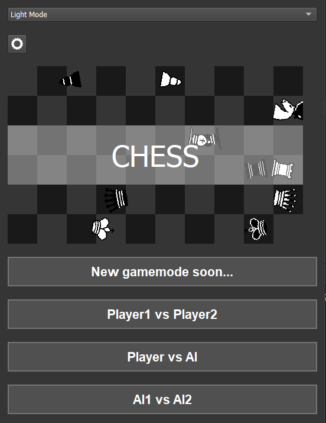
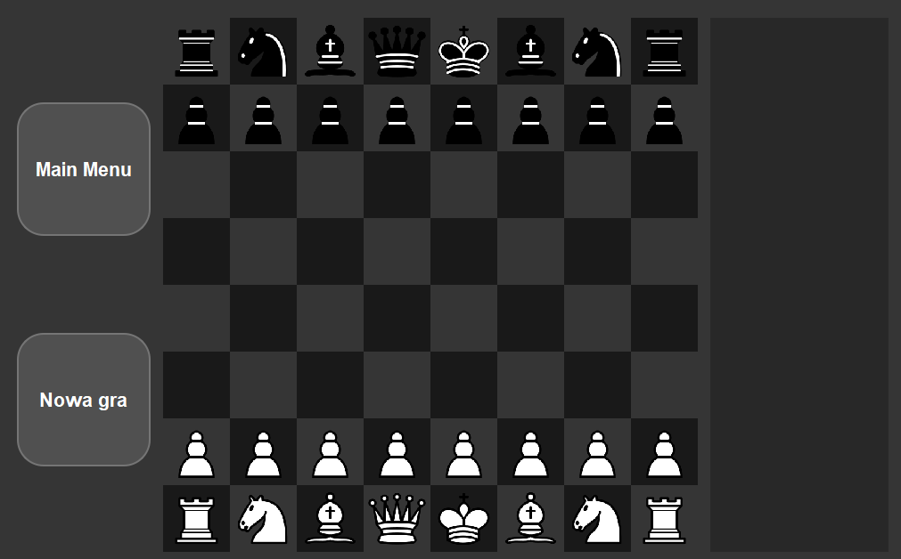

# Chess
----------------------------------------
Yes, that's it. The chess game that has built in bot that can play against you and all the rules necessary to play normal game of chess. 
There are some funky options like theme. Currently I'm working:
1. online mode
2. some fun details like clock for 2 player mode
3. difficulty options for bots.

<!-- Górna część: lista i wąski obrazek obok siebie -->

  <!-- Kolumna z listą -->
  

    <ol>
      <li>online mode</li>
      <li>some fun details like clock for 2 player mode</li>
      <li>difficulty options for bots</li>
    </ol>
  

  
  <!-- Kolumna z wąskim obrazkiem -->
  

    
  

<!-- Dolna część: duży, szeroki obrazek -->

  

