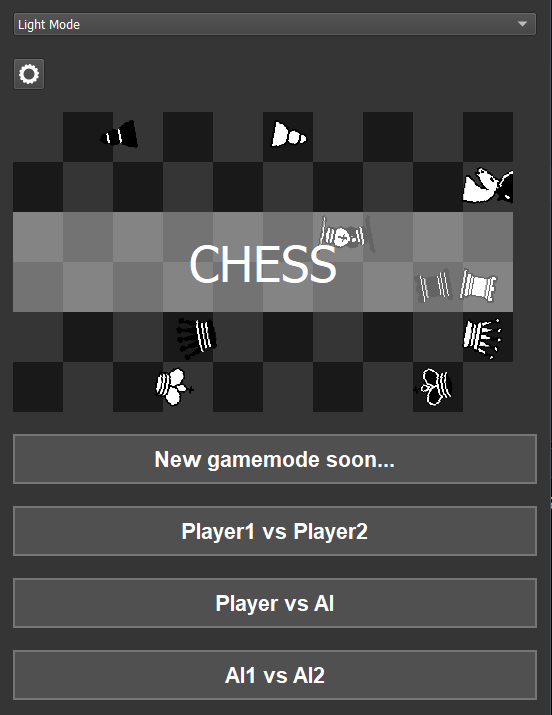
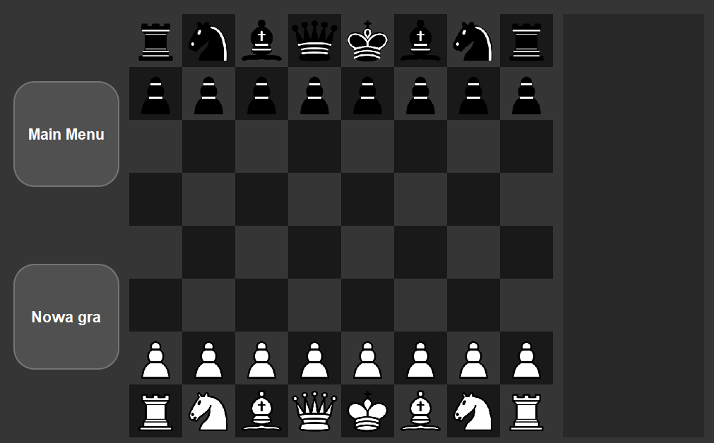

# Chess

Yes, that's it. The chess game that has built-in bot capabilities, allowing you to play against an AI with all the standard chess rules. 

<!-- Flexible Layout with List and Image Side by Side -->
<div style="display: flex; align-items: center; gap: 30px; margin-bottom: 20px;">
  <!-- Feature List -->
  <div style="flex: 2;">
    <h2>Current Features</h2>
    <ol>
      <li>Classic chess gameplay</li>
      <li>Built-in AI opponent</li>
      <li>Customizable themes</li>
    </ol>
  </div>
  
  <!-- Narrow Preview Image -->
  <div style="flex: 1;">
    
  </div>
</div>

## Actual gameplay

<!-- Large Full-Width Image -->
<div style="width: 100%; margin-top: 20px;">
  
</div>


### Creating .exe file
```powershell
uv pyinstaller --onefile --windowed `
--add-data "Figury;Figury" `
--add-data "Assets;Assets" ChessQT.py `
--onefile --add-data "Figury;Figury" `
```


## Work in Progress

- 🌐 Online multiplayer mode
- ⏱️ Two-player game clock
- 🤖 Multiple AI difficulty levels
